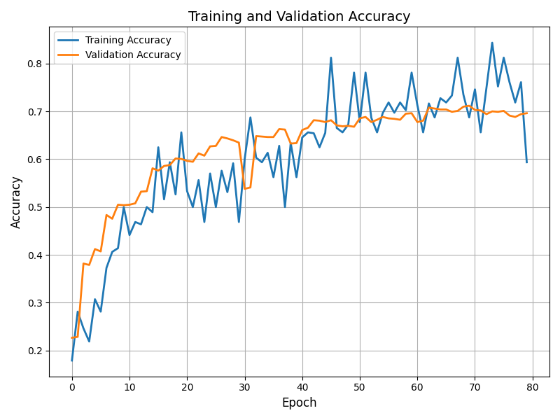
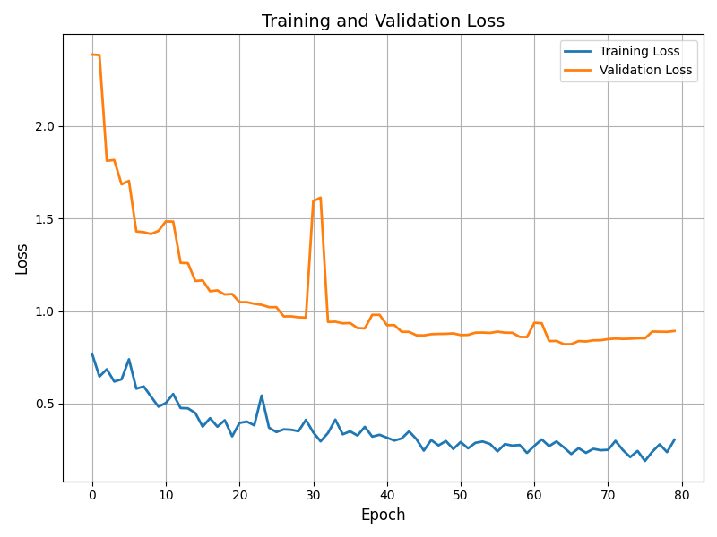
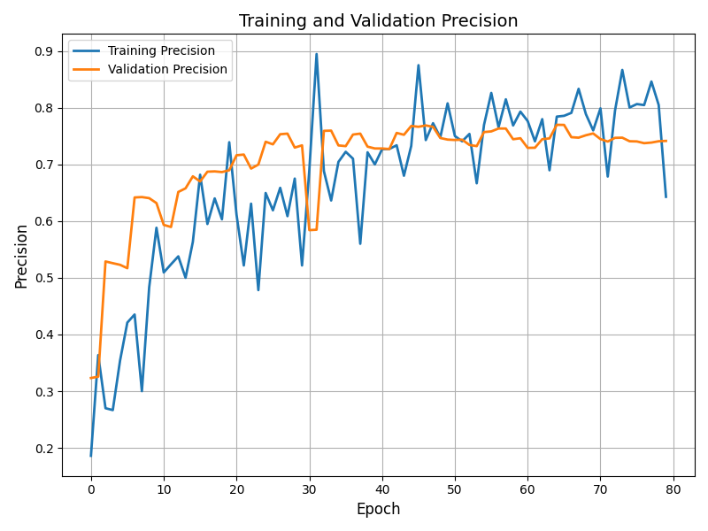
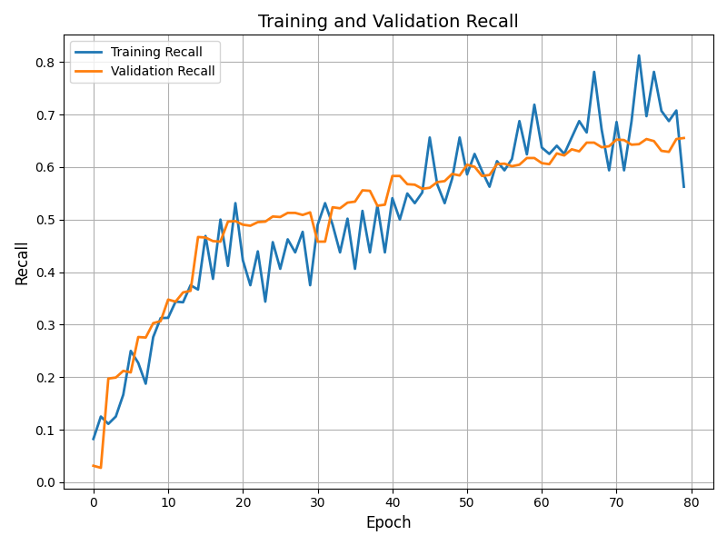
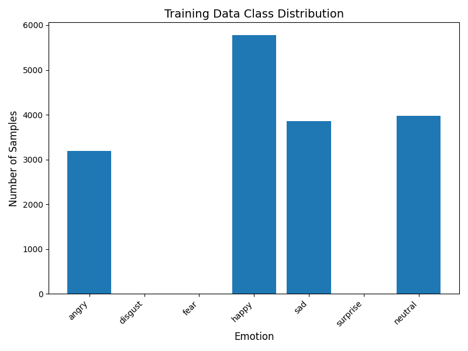

# Emotion Recognition from Facial Expressions

## Overview

This project implements a Convolutional Neural Network (CNN) with attention mechanism to recognize emotions from facial expressions in images. It provides a web interface built with Flask for users to upload an image and receive a prediction of the dominant emotion. The system leverages TensorFlow/Keras for the model and HTML/CSS for the user interface.

## Purpose

The primary purpose of this project is to accurately and efficiently classify human facial expressions into one of seven basic emotions: angry, disgust, fear, happy, neutral, sad, and surprise. Potential applications include:

* Affective computing
* Human-computer interaction
* Psychological research
* Market research
* Accessibility tools

## Key Features

* **Image Upload and Prediction:** Users can upload facial images through a user-friendly web interface to get real-time emotion predictions.
* **Seven Emotion Classification:** The CNN model classifies facial expressions into seven categories: angry, disgust, fear, happy, neutral, sad, and surprise.
* **Probability Output:** The system provides the probability distribution for each emotion, offering insights into the model's confidence.
* **Visualized Prediction Process:** The results page visually demonstrates the image processing pipeline, from the original upload to the preprocessed image and the final emotion output.

## Dataset

The project utilizes the **FER-2013 dataset**, a widely used benchmark for facial expression recognition. Key characteristics of the dataset:

* Grayscale images
* 48x48 pixel resolution
* Seven emotion categories: angry, disgust, fear, happy, neutral, sad, surprise
* Training, validation, and test sets

## Model Architecture

The core of the emotion recognition system is a custom-built CNN model. The architecture is designed to extract relevant features from facial images and classify them into the appropriate emotion category.

The model consists of the following layers:

1.  **Input Layer:** Accepts grayscale images of size 48x48 pixels.
2.  **Convolutional Blocks (4):**
    * `Conv2D` layers with ReLU activation and L2 regularization to extract spatial hierarchies of features.
    * `BatchNormalization` to improve training stability.
    * `MaxPooling2D` for downsampling and reducing dimensionality.
    * `Dropout` to prevent overfitting.
3.  **Attention Block:** An attention mechanism is incorporated after the second convolutional block to weigh the importance of different spatial regions.
4.  **GlobalAveragePooling2D:** Reduces the spatial dimensions to a single feature vector.
5.  **Dense Layers:** Fully connected layers with ReLU activation and L2 regularization.
6.  **Output Layer:** A Dense layer with softmax activation to produce the probability distribution over the seven emotion classes.

## Training Details

* **Optimizer:** Adam
* **Learning Rate:** 0.00005
* **Loss Function:** Categorical Crossentropy
* **Metrics:** Accuracy, Precision, Recall
* **Epochs:** 80
* **Batch Size:** 32
* **Early Stopping:** Used to prevent overfitting, monitoring validation accuracy with a patience of 20 epochs.
* **Class Weights:** Applied to address class imbalance in the FER-2013 dataset, calculated based on the training data distribution.

## Results

The performance of the emotion recognition model was evaluated using various metrics during training. Here are some key visualizations:

### Training and Validation Accuracy

_This plot shows the training and validation accuracy over epochs. It illustrates the model's learning progress and indicates how well it generalizes to unseen data.

### Training and Validation Loss

_This plot displays the training and validation loss over epochs. It demonstrates the model's ability to minimize the prediction error on both training and validation sets. A decreasing trend in both losses is desirable, indicating that the model is learning effectively.

### Training Precision

_This plot visualizes the training precision over epochs. Precision measures the proportion of correctly predicted positive cases among all instances predicted as positive. High precision indicates fewer false positives, meaning the model is more reliable when it predicts a specific emotion._

### Training Recall

_This plot shows the training recall over epochs. Recall measures the proportion of correctly predicted positive cases among all actual positive instances. High recall indicates fewer false negatives, meaning the model is good at identifying all instances of a specific emotion._

### Class Distribution

_This plot illustrates the distribution of samples across the seven emotion classes in the training dataset. It highlights potential class imbalance, where some emotions have significantly more training examples than others. Class imbalance can bias the model towards the majority classes, which was addressed during training using class weights to give more importance to the minority classes._

## Web Application

The web application, built with Flask, provides a user interface for interacting with the emotion recognition model.

* `index.html`: The main page where users can upload an image.
* `results.html`: Displays the prediction results, including the original and processed images, the predicted emotion, and the probability distribution for all emotions.

## Future Improvements

* Improve model accuracy with more advanced architectures (e.g., EfficientNet, Transformer-based models) or training techniques (e.g., data augmentation, transfer learning).
* Explore techniques to handle occlusions and variations in pose and lighting conditions.
